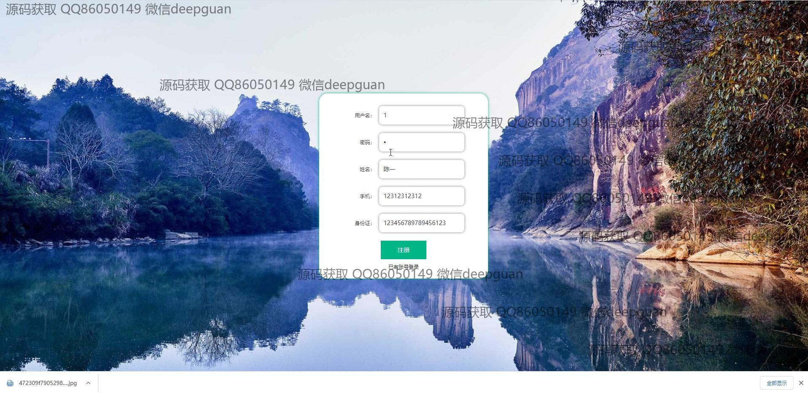
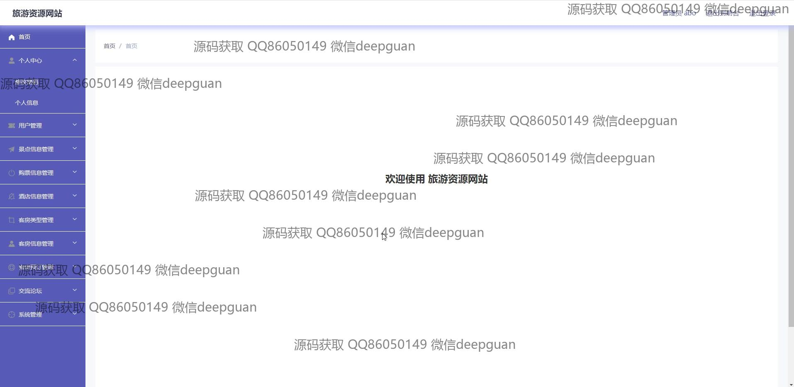

<h1 align="center">旅游资源网站vue</h1>

## 简介
旅游资源网站：角色分为管理员、用户；功能包括用户管理、景点信息管理、酒店信息管理、客房信息管理、论坛互动、系统管理及购票功能，支持信息增删改查和富文本编辑。    --计算机毕业设计源码；毕设源码；java毕业设计源码

## 联系方式

<h3 align="center">获取完整代码与数据库文件 + 微信：deepguan QQ: 86050149 QQ群: 783742310</h3>

<h3 align="center">可帮忙远程部署 包运行成功！提供远程部署、修改代码、设计文档指导、代码讲解等服务！</h3>

## 功能介绍（完整见运行截图）
管理员：基本功能包括登录、注册和退出权限，网站首页设有主导航栏，提供景点信息、酒店信息、客房信息、红色文化和用户中心等模块。管理后台允许对用户、景点、酒店和客房信息进行增删改查，支持图文并茂的内容管理。管理员可在留言回复界面与用户互动，更新论坛帖子和发表评论，并通过轮播图管理模块优化网站展示效果。

用户：用户可通过注册和登录访问网站，首页导航栏提供快捷访问景点、酒店和客房信息的入口。用户可在详细页面浏览景点评级、酒店类型及客房信息，预订酒店客房并使用日期选择器设置入住时间。交流论坛支持用户发布主题帖子、评论和互动，通过个人中心管理个人信息、收藏及订单。购票模块允许用户输入所需信息进行在线订票操作，提升旅游规划体验。

## 运行截图

本代码来源于网络,仅供学习参考使用!

